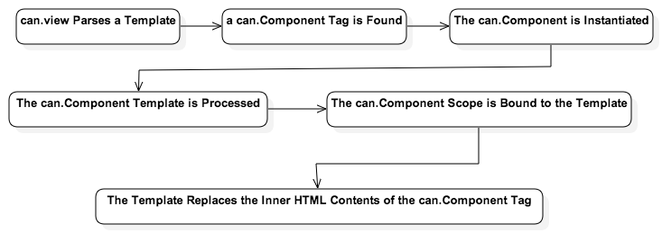
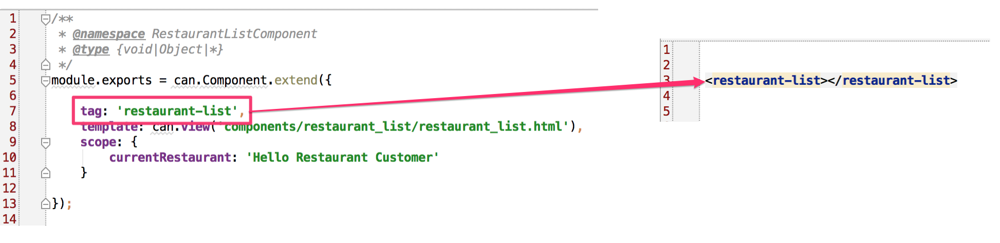

#Getting to Know Components

- - - -
**In this Chapter**
 - Constructors in CanJS
 	- The `extend` method
 	- The `init` method
 - First can.Component
 	- Auto Instantiation
 	- Anatomy of a can.Component

> Get the code for: [chapter 2](https://github.com/joe-crick/UpAndRunningWithCanJS/tree/master/PlaceMyOrder/chapter_2)

- - -

##First can.Component 
If you recall from the introduction, a can.Component is like a self-contained, mini web application---i.e., it's encapsulated. Because can.Components are encapsulated, they should each contain their own:

- View template (.stache file)
- JS
- CSS

This is why we created a components directory for our app---instead of, say, a JS directory. Each component we develop will be in a directory that contains all the files that support that component. This makes components portable, enabling you to reuse them across projects. It also isolates them, making them easier to test and maintain.

In the components directory, create a subfolder called "restaurant_list". Inside that, create the following files:

- restaurant_list_component.js
- restaurant_list.stache

Put the following code inside restaurant_list_component.js:

	/**
     * @namespace RestaurantListComponent
     */
    can.Component.extend({

        tag: 'restaurant-list',
        template: can.view('components/restaurant_list/restaurant_list.stache'),
        scope: {
                currentRestaurant: 'Hello Restaurant Customer'
        }

    });

Add the following code to restaurant_list.stache:

	<h1>{{currentRestaurant}}</h1>

Add the code below to the /app/base_template.stache file:

	<restaurant-list></restaurant-list>

Next, open up your app.js file, and edit it as follows:

	$(function () {

        $('#can-app').html(can.view('base_template.stache', {}));

    });

For the moment, if you don't know what can.view does, don't worry. We'll go over it in detail soon.

Finally, we need to add a reference to restaurant_list_component.js in the index.html file, as follows:

	
	
    
      <!--Begin add-->
      
      <!--End add-->
    

Now, go back out to your app in the browser, and refresh it. You should see it printing: "Hello Restaurant Customer".

###Auto Instantiation

If you recall from the discussion above regarding can.Construct, whenever you declare an object using can.Construct it must be instantiated. Normally, you would either directly instantiate objects using the `new` keyword, or pass the constructor to an object that would create instances of it. *can.Component is an exception*.

All we have to do is declare the can.Component using its `extend` method.  Once you declare your can.Component, you've registered your component with the system. When CanJS parses the base_template.stache file, and encounters the "restaurant-list" tag, it will automatically instantiate the can.Component associated with it, generate the Component's view inside of its custom tag, and bind that view to your component's scope.

Let's look at an image that describes how all of this works, to make it clearer:

###Basic Anatomy of a can.Component
The can.Component we created above had three properties.

- tag,
- template, and
- scope

####The "tag" Property
The can.Component's `tag` property associates that can.Component with a specific, custom HTML tag:

As mentioned above, when the template containing the can.Component's tag is parsed, the can.Component is instantiated, and the contents of its rendered template are inserted as the HTML contents of the custom tag:

####Template
The `template` property of the can.Component contains the string value of the can.Component's template. Note that the template property just contains a string value. You can inline the template, if it is small. However, the recommended way of working with templates, to maintain separation of concerns, is to keep them in their own files and load them using can.view, as we have done here.

####Scope
The `scope` object is the can.Component's view model. The view model is an abstraction of the view that exposes public properties and functions. Any property or method defined on the scope object is available from the can.Component's template as either a Stache data key, or a function. In our example above, we created a property, "currentRestaurant", and then referenced it as a Stache data key in our template.

#####can.Map &amp; can.List
The scope is a special type of object, called a "can.Map". can.Map objects are observable. Observable objects emit events whenever their properties change. can.view (and subsequently can.Component) subscribe to these events and update the DOM as needed. If you've cross-bound the values between your scope and your view, changes to your view will also be reflected in your scope. We'll see how this works in the next chapter.

can.Map is able to emit these events because of the `attr` method. This is important. In order to broadcast the associated events when you change a property on a `can.Map`, you must use the `attr` method when setting or getting a value.

The `attr` method can be used to either get or set a property on a can.Map. 
      
    var myCanMapInstance = new can.Map({
      id: 12,
      person: {
        name: {
          last: 'Ludwick'
          last: 'Beethoven'
        }
      } 
    });

    myCanMapInstance.attr('id'); // -> 12

`attr` works with deep properties---i.e., properties within properties. Here's an example:

    //Get the first property off of the name property off of person
    myCanMapInstance.attr('person.name.first');

    //Set the last property of the person's name property
    myCanMapInstance.attr('person.name.last', 'Bach');

Observable arrays are also available with can.List, which is based on can.Map.