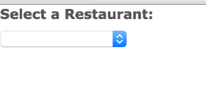
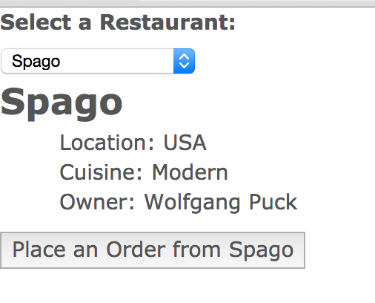

# Models (&amp; Fixtures) 

The next item we're going to go over is can.Model. Models make interacting with JSON REST services *really easy*. They do this by encapsulating a lot of the code required to connect to a service, and managing the data the service returns. Additionally, can.Model extends can.Map, meaning that the objects returned by a model are observable---and they have all of the features of a can.Map.

We'll use a can.Model to provide data for our restaurant list.

In the models folder, create a file called "site_models.js". Add the following code:

	/**
     * Restaurants Model
     */
	var RestaurantModel = can.Model.extend({
        findAll: "GET /restaurants"
    },
    //Include second, blank parameter object to set staticProperties
    {});

Because it is a can.Construct, can.Model.extend can take up to three parameters:

1. name
2. staticProperties
3. instanceProperties

A can.Model's staticProperties parameter has several reserved properties you can add that simplify accessing data from a JSON REST service. These properties are:

1. findAll
2. findOne
3. create
4. update
5. destroy

The findXxx methods are available directly off of the object definition (i.e., they are static). The create, update, and destroy methods are available off of specific instances of a can.Model. We'll see how to use these below.

**Reminder**: The number of parameters you pass in to an extend method is important. If you pass in a single parameter object, the extend method will use that to set the instanceProperties. If you pass in two parameter objects, the *first* object passed in will be used to set the *staticProperties*. The second parameter will be used to set the *instanceProperties*. Here, we only want to set the staticProperties, so we must pass in a second, blank object.

##The Data for Our Model

We're not going to connect to a server to retrieve our data; however, we're going code our model as if we were. How can this possibly work? CanJS provides a handy utility, can.fixture, that we can use to mimic the functionality of connecting to a server. As the CanJS docs say, "can.fixture intercepts an AJAX request and simulates the response with a file or a function. You can use them to develop JavaScript independently of backend services."

can.fixture is not included with the base CanJS package. We included it, however, when we downloaded our custom build.

Let's create a fixture that will respond to our requests for menu item data. We want to keep our fixtures separate from our models (in a real world application, we would remove the fixtures once the services were available) Create another file in the models folder called "fixtures.js". Add the following code to that file:

	/**
     * Restaurants Model Fixture
     */
    can.fixture("GET /restaurants", function requestHandler() {
        return [
            {
                "name": "Spago",
                "location": "USA",
                "cuisine": "Modern",
                "owner": "Wolfgang Puck",
                "id": 1
            },
            {
                "name": "El Bulli",
                "location": "Spain",
                "cuisine": "Modern",
                "owner": "Ferran Adria",
                "id": 2
            },
            {
                "name": "The French Laundry",
                "location": "USA",
                "cuisine": "French Traditional",
                "owner": "Thomas Keller",
                "id": 3
            }
        ];
    });

The first argument to can.fixture, "GET /restaurants", tells CanJS to intercept any GET requests to the resource "/restaurants". The second argument is a function that returns the data we want to return when the application makes a service call. Because we're simulating a findAll method, we need to return an array. The findAll method expects an array. If it does not receive one, it will throw an error.

##Connecting the Model to the Component

It's time to connect all of this together in our view model. Open up restaurant_list_component.js, and edit the RestaurantListViewModel as follows, updating the restaurants property to receive data from the model we created:

    var RestaurantListViewModel = can.Map.extend({
        restaurants: new RestaurantModel.List({}),
        currentRestaurant: undefined,
        restaurantSelected: function (viewModel, select) {
            var restaurant = select.find('option:checked').data('restaurant');
            var currentRestaurant = 'currentRestaurant';
            this.attr(currentRestaurant, restaurant);
        }
    });

Note that there are a few ways to call a findAll method on a can.Model. The first way is to call the method explicitly. Using the RestaurantModel as an example, that would look like this:

	RestaurantModel.findAll({//paramsObject},
		function success(returnedObject){
			//
		},
		function error(errorObject){
			//
		});

In the code above, however, we called the findAll method indirectly. We did it in this line:

	restaurants: new RestaurantModel.List({}),

This is a special feature of the can.Model.List constructor. When can.Model is extended, can.Model.List is automatically extended, as well. It is set as the model's List property. If a can.Model.List is instantiated, and you pass in a plain JavaScript object for its construction parameter, that parameter is used as the parameter for the Model's findAll method. At first, this will return an empty list; however, the can.Model's findAll method will then be called, and the list will be populated with the results of that call automatically, once the findAll method receives its results.

We'll look at the can.Model's findOne method later on, when we create our Menu Component. Finally, let's add the scripts we created to our index.html file:

    
    
    <!--Begin add-->
    
    
    <!--End add-->
    
    

Let's go back to our app now, and see what happens! If everything went according to plan, you should see something like this:

And, when you select a restaurant from the list, you should see:

