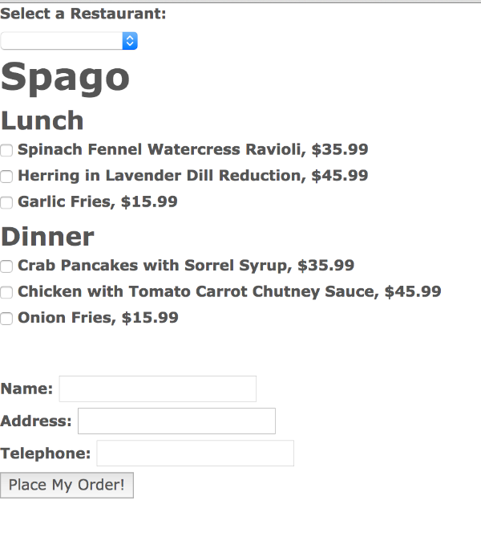
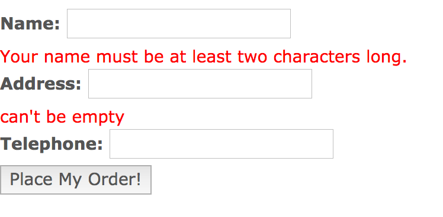

#Model Data Validation

As mentioned in the previous chapter, can.Model extends can.Map. can.Map provides us with some very useful validation utilities. Before we dive into data validation, however, let's set up a can.Component that will have data we can validate. Let's create a restaurant menu from which people can select items to order.

Create a sub folder under components called "order_form". In the order_form folder, create the following files:

- order_form.stache
- order_form_component.js

Add the following to order_form.stache:

	{{#menus}}
        <h1>{{restaurantName}}</h1>

        {{#each collection}}

            <h3>{{menuName}}</h3>

            {{#each items}}
                <label>
                    <input type="checkbox" can-value="selected"> {{name}}, ${{price}}
                </label>
            {{/each}}

        {{/each}}

    {{/menus}}

    {{#delivery}}

        

            <label>Name:
                <input type="text" can-value="name" id="name"/>
                
{{issues.name}}

            </label>

            <label>Address:
                <input type="text" can-value="address" id="address"/>
                
{{issues.address}}

            </label>

            <label>Telephone:
                <input type="tel" can-value="telephone" id="telephone"/>
            </label>

    {{/delivery}}

    <button can-click="placeOrder">Place My Order!</button>

In the template above, we're binding the values:

- name
- address
- telephone

to the "delivery" object of the View Model. We do that using both the delivery section, defined by {{#delivery}} ... {{/delivery}}, and the "can-value" attribute. The can-value attribute is a can.view attribute that establishes two-way binding between an element in a template, and its associated View Model.

Add the following to order_form_component.js:

	var OrderFormViewModel = can.Map.extend({
        init: function () {
            this.attr('delivery', {});
            this.attr('order', {});
            this.attr('issues', {});
            this.attr('menus', {});
        }
    });

    var orderFormViewModel = new OrderFormViewModel();

    can.Component.extend({
        tag: "order-form",
        template: can.view('components/order_form/order_form.stache'),
        scope: orderFormViewModel
    });

    RestaurantMenusModel.findOne({id: 1},
        function success(selectedMenus) {
            orderFormViewModel.attr('menus', {
                collection: selectedMenus.menus,
                restaurantName: "Spago"
            });
        },
        function error(xhr) {
            alert(xhr.message);
        });

Then, in the models folder, edit fixtures.js, appending the following to the bottom of the file:

	/**
     * Restaurant Menus Fixture
     */
    can.fixture("GET /restaurantMenus/{id}", function requestHandler(request) {

        var id = parseInt(request.data.id, 10) - 1;

        var menuList = [
            {
                //Spago
                "menus": [
                    {
                        "menuName": "Lunch",
                        "items": [
                            {name: "Spinach Fennel Watercress Ravioli", price: 35.99, id: 32},
                            {name: "Herring in Lavender Dill Reduction", price: 45.99, id: 33},
                            {name: "Garlic Fries", price: 15.99, id: 34}
                        ]
                    },
                    {
                        "menuName": "Dinner",
                        "items": [
                            {name: "Crab Pancakes with Sorrel Syrup", price: 35.99, id: 22},
                            {name: "Chicken with Tomato Carrot Chutney Sauce", price: 45.99, id: 23},
                            {name: "Onion Fries", price: 15.99, id: 24}
                        ]
                    }
                ]

            },
            {
                //El Bulli
                "menus": [
                    {
                        "menuName": "Lunch",
                        "items": [
                            {name: "Spherified Calf Brains and Lemon Rind Risotto", price: 35.99, id: 32},
                            {name: "Sweet Bread Bon Bons", price: 45.99, id: 33},
                            {name: "JoJos", price: 15.99, id: 34}
                        ]
                    },
                    {
                        "menuName": "Dinner",
                        "items": [
                            {name: "Goose Liver Arugula Foam with Kale Crackers", price: 35.99, id: 22},
                            {name: "Monkey Toenails", price: 45.99, id: 23},
                            {name: "Tater Tots", price: 15.99, id: 24}
                        ]
                    }
                ]

            },
            {
                //The French Kitchen
                "menus": [
                    {
                        "menuName": "Lunch",
                        "items": [
                            {name: "Croque Monsieur", price: 35.99, id: 32},
                            {name: "Pain Au Chocolat", price: 45.99, id: 33},
                            {name: "Potato Latkes", price: 15.99, id: 34}
                        ]
                    },
                    {
                        "menuName": "Dinner",
                        "items": [
                            {name: "Chateau Briande", price: 35.99, id: 22},
                            {name: "Veal Almandine", price: 45.99, id: 23},
                            {name: "Hashbrowns", price: 15.99, id: 24}
                        ]
                    }
                ]

            }
        ];

        return menuList[id];
    });

In site_models.js, add the following model:

    /**
     * RestaurantMenusModel
     * @type {void|*}
     */
    var RestaurantMenusModel = can.Model.extend({
        findOne: "GET /restaurantMenus/{id}"
    },
    {});

Edit base_template.stache, and add in the custom HTML tag for the order_form component:

    <restaurant-list></restaurant-list>
    <!--Begin add-->
    <order-form></order-form>
    <!--End add-->

Now, edit your index.html file to load the order_form_component.js file:

    
    <!--Begin add-->
    
    <!--End add-->
    

Go out to your app in the browser, and reload your page. You should see the following:

One thing you might immediately notice is that both the Restaurant List component, and the Order Component are both showing on the page. Don't worry about that for the moment. We'll deal with controlling which Components display when we set up our Application State and Routing.

##Validation
Now that we have a component that takes user input, let's add some data validation. In CanJS, data is validated at the model. As you may recall, can.Model extends can.Map. can.Map exposes several validation functions---provided as a plugin, which we included when we downloaded our custom build of CanJS.

Validations are set on the init function of the staticProperties parameter. 

>Recall that a can.Construct.extend takes three optional parameters. If you supply it with one parameter, it assumes that parameter is the instanceProperties parameter. If you pass it two parameters, it assumes the first parameter is the staticProperties parameter, and the second parameter is the instanceProperties parameter. You can forget to append this second object, and your findXxx methods will still work. Your validations, however, will not. If you discover you're getting a validation error, one of the first places to check is to see if you have correctly passed in an object as the second parameter of your call to can.Model.extend.

Let's set up some basic validations for our application. Open up site_models.js, and update the MenuOrder model as follows:

	var MenuOrderModel = can.Model.extend({
            create: 'POST /createOrder',
            init: function () {
                //validates that the address field has been filled in
                this.validatePresenceOf('delivery.address');

                // validates that name is at least two chars long
                this.validate("delivery.name", function (name) {
                    if (!name) {
                        return "Your name must be at least two characters long."
                    }
                    if (name.length < 2) {
                        return "Your name must be at least two characters long."
                    }
                });

            }
        },
        {});

Open up order_form_component.js, and edit the it, as follows:

	function createOrder(menuItems) {
        this.attr('menus.collection').each(function (itemSet) {
            itemSet.attr('items').each(function (item) {
                if (item.attr('selected')) {
                    menuItems.push(item);
                }
            });
        });

        return new MenuOrderModel({
            delivery: this.attr('delivery'),
            menuItems: menuItems
        });
    }

    function validateOrder(order, errors) {
        var errorCheck = order.errors();

        for (var issue in errorCheck) {
            if (errorCheck.hasOwnProperty(issue)) {
                errors[issue.replace('delivery.', '')] = errorCheck[issue][0];
            }
        }
        return errorCheck;
    }

    var OrderFormViewModel = can.Map.extend({
        init: function () {
            this.attr('delivery', {});
            this.attr('order', {});
            this.attr('issues', {});
            this.attr('menus', {});
        },
        placeOrder: function () {

            var menuItems = [];
            var order, errorCheck, errors = {};

            order = createOrder.call(this, menuItems);

            errorCheck = validateOrder(order, errors);

            if (errorCheck) {
                this.attr('issues', errors);
                return;
            }
            var that = this;

            order.save(
                function success() {
                    that.attr('confirmation', 'Your Order has been Placed');
                }, function error(xhr) {
                    alert(xhr.message);
                });

            this.attr('order', order);
        }
    });

    var orderFormViewModel = new OrderFormViewModel();

    can.Component.extend({
        tag: "order-form",
        template: can.view('components/order_form/order_form.stache'),
        scope: orderFormViewModel
    });

    RestaurantMenusModel.findOne({id: 1},
        function success(selectedMenus) {
            orderFormViewModel.attr('menus', {
                collection: selectedMenus.menus,
                restaurantName: "Spago"
            });
        },
        function error(xhr) {
            alert(xhr.message);
        });

Let's look at a few items in the code above. Notice that we're creating a new instance of a model in the createOrder function---MenuOrderModel. We assign the value of this.attr('details') to the MenuOrderModel's delivery property. If you recall, we bound the values of the name, address, and telephone number fields to the "details" object in the order_form.stache view template. Now, all we need to do to get the values of those fields is reference them off of the View Model's details property.

When we created the RestaurantListComponent, we used the {{data '...'}} Stache key, and jQuery to obtain a reference to the restaurant object associated with the choice the user selected in the restaurants dropdown. Ideally, we don't want to be interacting with the DOM directly in our application. We want CanJS to do that for us, so we can focus on the application itself. Here, in the createOrder function, we refer directly to the data in our scope. We loop through the collection of menu items, creating an array of those that have been selected, rather than using jQuery to select them from the DOM.

Go back out to your application, and refresh it. Once the page loads, click on the "Place My Order" button. You should see the following:

In the next chapter, we'll talk about connecting all of our components together using the Application State, Routing, and can.Map's define plugin.