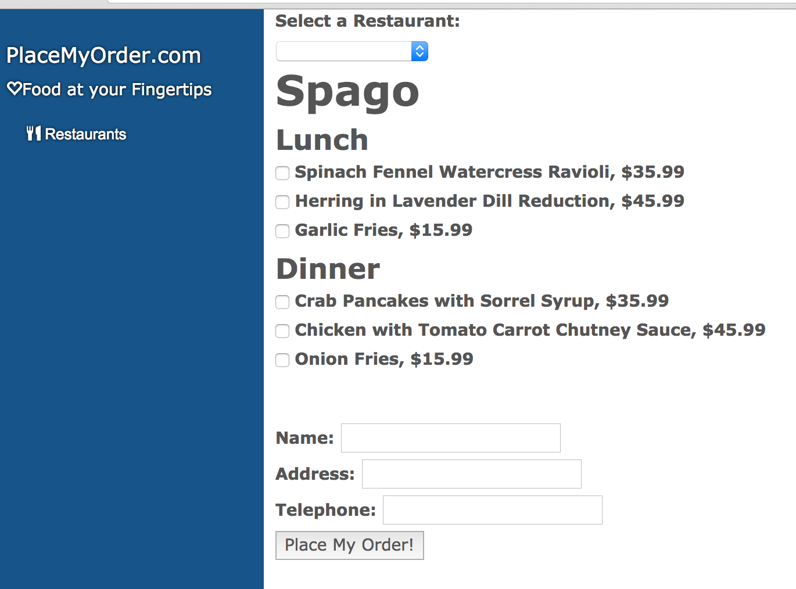

#Reinforcing Concepts: Creating the Menu Component
We should know enough at this point to successfully create our Menu component. Going through the steps will be a good review of what we've covered so far, and help you solidify your understanding of CanJS. We'll also cover some additional functionality from the objects we already know, such as the findOne method of can.Model.

In your models folder, open fixtures.js. Add the following code to register a new can.fixture:

	can.fixture("GET /site_menu", function requestHandler() {
       return {
           menuText: {
               "PageTitle": "PlaceMyOrder.com",
               "FoodAtFingertips": "Food at your Fingertips",
               "Restaurants": "Restaurants",
               "Cuisines": "Cuisines"
           }
       };
    });

Open up site_models.js, and add a new can.Model:

    var SiteMenuModel = can.Model.extend({
            findOne: "GET /site_menu"
    });

In your components folder, create a new folder called "site_menu". In that folder, file called site_menu_component.js, and add the following code:

	var MenuViewModel = can.Map.extend({
        init: function () {
            this.attr('menuData', {});
        }
    });

    var siteMenuViewModel = new MenuViewModel();

    can.Component.extend({
        tag: "menu",
        template: can.view('components/site_menu/site_menu.stache'),
        scope: siteMenuViewModel
    });

After that, add the following line below the menu component's definition:

	    SiteMenuModel.findOne({},
        function success(menu) {
            siteMenuViewModel.attr('menuData',  menu);
        },
        function error(xhr) {
            alert(xhr.message);
        });

Similar to the can.Model findAll method, the findOne method takes a parameters object as its first argument. Optionally, you can pass in two call-back functions, the first being the success function, the second being the error function. The success function receives the object returned by the findOne call as the first parameter in its method signature. The error function receives the XmlHttpRequest object as the first parameter in its method signature. If the findOne operation is successful, the success method will be called. Otherwise, the error method is called.

In the example above, we create an observable can.Map object. We create an instance of that object, and assign it to the can.Component's scope. Because the can.Map object is observable, when we later update it's menuData property, the update is broadcast to the system, and the menu can.Component is refreshed with the menu data returned from the findOne method. There is currently no implicit method for calling can.Model.findOne. You must use the method described above.

Let's connect all of this to a view template. Staying in the menu folder, create a template file called "site_menu.stache", as follows:

        {{#menuData.menuText}}
        <ul class="nav">
            <li><a class="visible-xs text-center" data-toggle="offcanvas" href="#"><i
                    class="glyphicon glyphicon-chevron-right"></i></a></li>
        </ul>
        <ul id="sidebar-footer" class="list-unstyled hidden-xs">
            <li can-click="clickedAlert">
                <a href="#!home"><h4>{{PageTitle}}</h4>
                    <i class="glyphicon glyphicon-heart-empty"></i>{{FoodAtFingertips}}</a>
            </li>
        </ul>

        <ul id="lg-menu" class="nav hidden-xs">
            <li class="active"><a can-click="goHome" href="#"><i class="glyphicon glyphicon-cutlery"></i> {{Restaurants}}</a></li>
        </ul>

        <!-- tiny only nav-->
        <ul id="xs-menu" class="nav visible-xs">
            <li><a class="text-center" href="#!restaurants"><i class="glyphicon glyphicon-cutlery"></i></a></li>
        </ul>
    {{/menuData.menuText}}

Open up /app/base_template.stache, and add the following line to the top of the file:

	<menu id="sidebar" class="column col-sm-2 col-xs-1 sidebar-offcanvas"></menu>

Finally, add the script tag for the SiteMenuComponent to the index.html file:

    
    <!--Begin add-->
    
    <!--End add-->
    

If you go out to your application, and refresh it, you should see the following:

