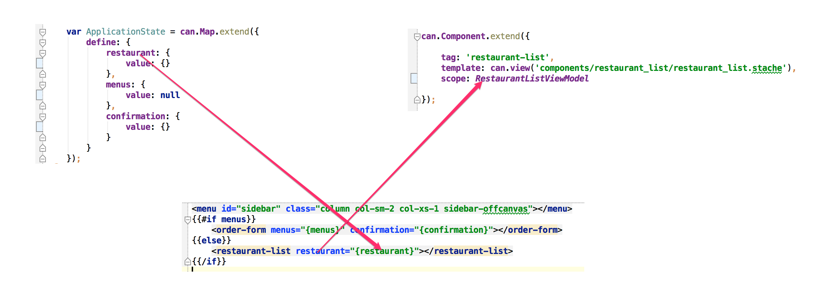
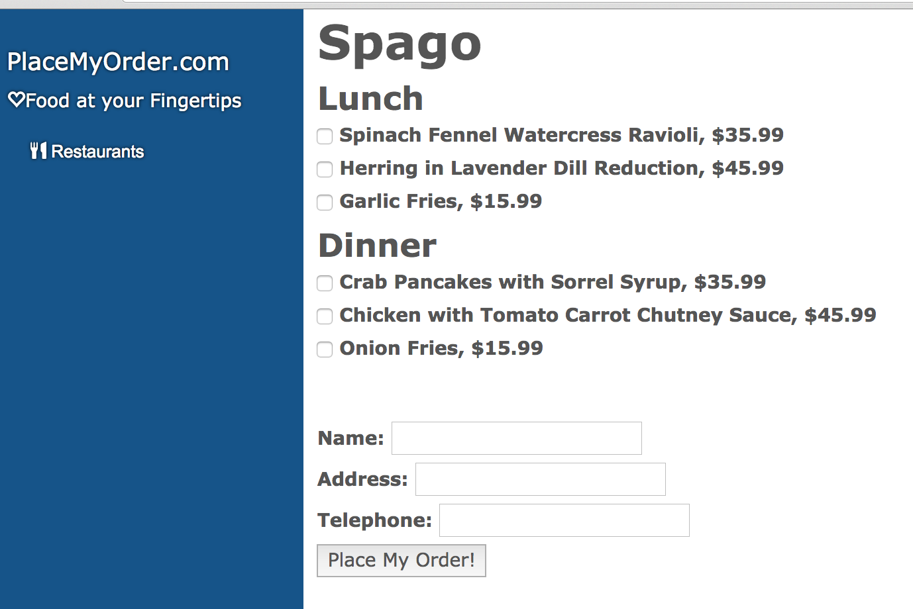

#Application State, and Basic Routing 
As mentioned in the [introduction](#introduction), CanJS uses an Application State object to manage the state of your application. The application state object is bound to two things:

1. The application's base template
2. The application's routing

Let's create an Application State object, and see how this works. Open up your app.js, and update it, as below. Note that the Application State object is a can.Map---i.e., it is observable. You should also notice that we're creating our can.Map in a new way---using the define plugin, which we'll discuss more below:

	$(function () {

       var ApplicationState = can.Map.extend({
        	define: {
            	restaurant: {
                	value: {}
            	},
            	menus: {
                	value: null
            	},
            	confirmation: {
                	value: {}
            	}
        	}
    	});

        var appState = new ApplicationState();

        //Bind the application state to the root of the application
        $('#can-app').html(can.view('base_template.stache', appState));

    	can.route.map(appState);

    	can.route.ready();

    });

##Routing
Before we dive into the details of the Application State object, let's quickly discuss routing. According to the docs, routing in CanJS allows us to "manage browser history and client state by synchronizing the window.location.hash with a can.Map." In other words, we can use routing to reflect the state of our application, or set the state of our application. One of the things that makes routing powerful is that it records the state of the application in the browser's history. We'll see some specific examples of this as we proceed.

In our application, we setup routing by:

- defining the properties of our Application State object,
- binding that object to the route with a call to can.route.map, and
- calling can.route.ready(), which sets up two-way binding between the browser's window.location.hash and the can.route's internal can.Map.

Unless we specify otherwise, which we'll see how to do below, *each property we define on our Application State will map to a potential route*. In the Application State we've defined, we will, by default, have the following *potential* routes:

- restaurant
- menus, and
- confirmation

Let's take a moment, now, to see how that works.

Add the following line of code to app.js:

	can.route.ready();

	//-->Add this line, below the line above:
    appState.attr('restaurant', 'Spago');

Now, refresh your app in the browser. The URL bar should look something like this:

Note that, after we initialized our routes, updating the value of our Application State's restaurant property caused the route to update, as well. The value of the restaurant and menus properties were serialized, and appended to the window.location.hash.

Let's see what happens if we adjust the value of the hash. To monitor this change, we'll need to make a slight adjustment to our Application State object. Modify the restaurant property as follows:

	restaurant: {
                value: {},
                set: function(newValue){
                   if(typeof newValue === 'string'){
                       alert(newValue);
                   }
                   return newValue;
                }
            },

Refresh your app in the browser. The first thing you should notice is that you get an alert box (or two) with the word "Spago" in it. By adding the set function above, we're controlling what happens when the Application State's restaurant property is set. More on that later. Click OK on the alert, go to the browser's URL bar, change the URL as follows:

Once you submit that URL, you should see an alert box that reads:

##Application Binding

It was mentioned earlier that we bound our Application State to the application's base_template.stache. This is the key to connecting the Application State to our components. We do that by passing Application State attributes to the components through their custom HTML tags in base_template.stache.

Open up base_template.stache, and edit it as follows:

	<menu id="sidebar" class="column col-sm-2 col-xs-1 sidebar-offcanvas" menus="{menus}" restaurant="{restaurant}"></menu>
    {{#if menus}}
        <order-form menus="{menus}" confirmation="{confirmation}"></order-form>
    {{else}}
        <restaurant-list restaurant="{restaurant}"></restaurant-list>
    {{/if}}

In the code above, we passed the "menus" and "restaurant" attributes to our Site Menu component, "menus" and "confirmation" to the Order Form components, and the "restaurant" attribute to the Restaurant List component. *These attributes will automatically be included in the scope of the components*.

Below is a diagram detailing how the connections work for connecting the restaurant property of the Application State to the Restaurant List component:

Let's update our components to communicate with our Application State.

Open up the restaurant_list_component.js file, and edit it as follows;

	var RestaurantListViewModel = can.Map.extend({
    	define: {
            currentRestaurant: {
                value: {},
                type: 'number',
                set: function (newValue) {
                    return isNaN(newValue) ? newValue : this.attr('restaurants')[(newValue - 1)];
                }
        	}
        },
        init: function () {
            this.attr('restaurants', new RestaurantModel.List({}));
            this.attr('currentRestaurant', {});
            this.attr('visible', true);
            this.attr('selected', {});
        },
        showMenu: function () {
            //Sets the restaurant value on the parent scope (AppState)
            this.attr('restaurant', this.currentRestaurant);
        }

	});

	can.Component.extend({
        tag: 'restaurant-list',
        template: can.view('components/restaurant_list/restaurant_list.stache'),
        scope: RestaurantListViewModel
	});

Note the showMenu function. From this function we access the "restaurant" value that was passed in to the can.Component's custom HTML tag.

Next, open up restaurant_list.stache, and link the PlaceOrder button with the showMenu function we've defined, as follows:

	 <button id="PlaceAnOrder" can-click="showMenu">Place an Order from {{name}}</button>

We've removed the DOM code from our View Model, and are now working directly with the application, so we need to update our view template to reflect these changes. In the same file (restaurant_list.stache), update template as follows ():

    {{#visible}}
        <label for="RestaurantList">Select a Restaurant:</label>
        <select id="RestaurantList" can-value="currentRestaurant">
            <option value="-1"></option>
            {{#each restaurants}}
                <option value="{{restaurantId}}">{{name}}</option>
            {{/each}}
        </select>

        {{#if currentRestaurant}}
            {{#currentRestaurant}}
                

                    <h3 id="RestaurantName">{{name}}</h3>
                    <ul id="RestaurantDetails">
                        <li>Location: {{location}}</li>
                        <li>Cuisine: {{cuisine}}</li>
                        <li>Owner: {{owner}}</li>
                    </ul>
                

                <button id="PlaceAnOrder" can-click="showMenu">Place an Order from {{name}}</button>
            {{/currentRestaurant}}
        {{/if}}
	{{/visible}}

Now, refresh your application, select a restaurant from the list, and click the place order button. You should see something like the following:

Finally, let's remove the code in the app.js that set the restaurant to "Spago" by default:

	//-->Remove this line:
    appState.attr('restaurant', 'Spago');

Now that we can see the connection between the component, and the Application State, let's make the code a little more useful. Update your Application State object, as follows:

	        define: {
            restaurant: {
                value: {},
                set: function (restaurant) {
                    if (restaurant.restaurantId) {
                        var that = this;
                        RestaurantMenusModel.findOne({id: restaurant.restaurantId},
                            function success(selectedMenus) {
                                that.attr('menus', {
                                    collection: selectedMenus.menus,
                                    restaurantName: restaurant.name
                                });
                            },
                            function error(xhr) {
                                alert(xhr.message);
                            });
                    }
                    return restaurant;
                }
            },
            ...

This will be a very common pattern in your applications. This setter is our event handler. Any time a restaurant is selected (i.e., the Application State's restaurant property is updated), we obtain its menus from our service, and then update the Application State's menus attribute.

To make the OrderForm component show, and the RestaurantList component hide, we use conditional stache tags in base_template.stache, as below:

	{{#if menus}}
        <order-form menus="{menus}" confirmation="{confirmation}"></order-form>
    {{else}}
        <restaurant-list restaurant="{restaurant}"></restaurant-list>
    {{/if}}

When there Application State's menus attribute has a value, the order form is displayed. Otherwise, the restaurant list is displayed. To see this in action, select a restaurant from the list, and click the "Place an Order from ____" button. You should see something like this:

