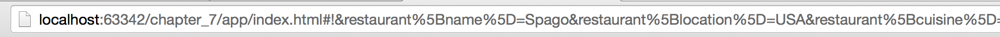
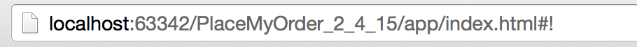
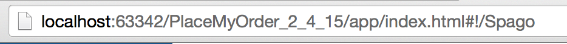

#Routing Continued: Route Formatting & Serialization
As mentioned earlier, each property you define on an Application State will serialize to a route by default when you bind that Application State with can.route, using can.route.map(). In our current Application State, that means we will have default routes for:

- restaurant
- menus, and
- confirmation

What if we don't want one of our Application State's properties to serialize to a route? What if you want to change the way the value of the attribute is serialized? This is where the serialize attribute of a property declared by the define plugin comes into play.

Open up your application, select a restaurant from the drop down list, and click, the "Place an Order from ____" button. You should see something similar to the following in your URL bar:

That's not pretty, and not very useful. We don't want the confirmation or menu attributes to serialize. Open up app.js, and edit the Application State object as follows:

    var ApplicationState = can.Map.extend({
        define: {
            restaurant: {
                value: {},
                set: function (restaurant) {
                    if (restaurant.restaurantId) {
                        var that = this;
                        RestaurantMenusModel.findOne({id: restaurant.restaurantId},
                            function success(selectedMenus) {
                                that.attr('menus', {
                                    collection: selectedMenus.menus,
                                    restaurantName: restaurant.name
                                });
                            },
                            function error(xhr) {
                                alert(xhr.message);
                            });
                    }
                    return restaurant;
                }
            },
            menus: {
                value: null,
                serialize: false
            },
            confirmation: {
                value: {},
                serialize: false
            }
        }
    });

Go back out to the app, refresh it, and load a restaurant menu again (Select a restaurant, and click the "Place Order from_ _ _" button). Your URL bar should now look something like this:

Much cleaner, but now it's missing information we might want. Add the following code before the call to can.route.ready():

	can.route('/:restaurant');

This line tells can.route to match any route going to the restaurant, and format it so that it is a forward slash followed by the serialized value. Add a serialize property to the restaurant attribute of the Application State object as follows:

    restaurant: {
       ...
       serialize: function () {
           return this.attr('restaurant.name');
       }
    }

Now, when you select a restaurant and click the Place Order buton, you should see the following in the URL bar:

Finally, let's update the setter so that we can change restaurants by typing in the correct restaurant name into the hash. Open up site_models.js, and edit the RestaurantModel, as follows:

	var RestaurantModel = can.Model.extend({
            findAll: "GET /restaurants",
            findOne: 'GET /restaurant/{name}'
        },
        {});

Next, add the following code to Fixtures.js:

	can.fixture("GET /restaurant/{name}", function requestHandler(request) {

        var restaurantMap = {
            "Spago": {
                "name": "Spago",
                "location": "USA",
                "cuisine": "Modern",
                "owner": "Wolfgang Puck",
                "restaurantId": 1
            },
            "El_Bulli": {
                "name": "El Bulli",
                "location": "Spain",
                "cuisine": "Modern",
                "owner": "Ferran Adria",
                "restaurantId": 2
            },
            "The_French_Laundry": {
                "name": "The French Laundry",
                "location": "USA",
                "cuisine": "French Traditional",
                "owner": "Thomas Keller",
                "restaurantId": 3
            }
        };

        return restaurantMap[request.data.name];

    });

Finally, update the Application State object in app.js, as follows:

	function getRestaurantMenu(restaurant, that) {
            RestaurantMenusModel.findOne({id: restaurant.restaurantId},
                function success(selectedMenus) {
                    that.attr('menus', {
                        collection: selectedMenus.menus,
                        restaurantName: restaurant.name
                    });
                },
                function error(xhr) {
                    alert(xhr.message);
                });
        }

        var ApplicationState = can.Map.extend({
            define: {
                restaurant: {
                    ...
                    set: function (restaurant) {
                        var that = this;

                        if (!restaurant) return restaurant;

                        if(typeof restaurant === 'string'){
                            RestaurantModel.findOne({name: restaurant},
                            function success(restaurantModel){
                                getRestaurantMenu(restaurantModel, that);
                            },
                            function error(xhr){
                                alert(xhr.message);
                            })
                        }

                        if (restaurant.restaurantId) {
                            getRestaurantMenu(restaurant, that);
                        }
                        return restaurant;
                    }
                },
                ...

Note, that we've refactored the call to RestaurantMenusModel out into its own function. Now, when you change the value of the restaurant in the URL, the menu changes as well.

##Wrapping up
The last thing we need to do is add functionality to our Site Menu. Open up site_menu_component.js, and add the following method to MenuViewModel:

	var MenuViewModel = can.Map.extend({
		...
        goHome: function (viewModel, element, event) {
            this.attr('menus', null);
            this.attr('restaurant', null);
            event.preventDefault();
        }
    });

This method resets the Application State's menus and restaurant attributes, passed in via the custom HTML tag in base_template.stache.

Select a restaurant from the list, then click the Place Order button. Once a menu displays, click on the Restaurants link. The menu will disappear, and the application will be returned to the default state, where you select a restaurant form the list. 
