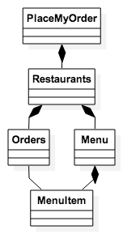

#Application Foundations 
	
The first step in putting together a CanJS app is sketching out the various states of your application, as you understand them at the moment[^requirements], and any supporting elements you might need. 

[^requirements]: Requirements are always subject to change!

We’ll be building a small application called "PlaceMyOrder". PlaceMyOrder is a website that lets you select from available restaurants in your area, view their menus, and purchase menu items for delivery. For this sample application, we’ll keep things pretty simple. We won’t worry about registration, authentication, or payment processing. We’re just going to create an application with three states: 

1. Restaurant Listings
2. Menu Listings
3. Order Placement

Now that our basic environment has been setup, and we have an outline of what we're going to build, let's start working with actual code. This step will involve setting up our foundations:

- Page Chrome (index.html)
- Bootstrapping 

###index.html 
Let's dive in to the good stuff, and start working with the app! Create a file called "index.html" in the app folder.

- app
    - index.html

It should look like this:

    <!DOCTYPE html>
    <html>
    <head lang="en">
        <meta charset="UTF-8">
        <title></title>
        <link rel="stylesheet" type="text/css" href="//maxcdn.bootstrapcdn.com/bootstrap/3.3.1/css/bootstrap.min.css"/>
        <link rel="stylesheet" type="text/css" href="site_css/PlaceMyOrder.css"/>
    </head>
    <body>
    
    <!-- CanJS application root -->
    
    
    

    
    
    
    
    
    
    </body>
    </html>

To simplify things, we're going to use Bootstrap for our CSS. Any additional styles, we'll place in a file called PlaceMyOrder.css. You should create this file and place it in your css folder.

The root of the CanJS application is the div#can-app.

At the bottom of the page, just before the body tag, are all of the script tags. The first script tag loaded must be jQuery. Following jQuery, we load can.jquery.js. This is the core CanJS library. We're also going to include two supplemental files:  can.fixture.js, and can.stache.js. In future releases of CanJS, you won't need to load can.stache.js. It will be bundled with the main CanJS file. We include can.fixture because it will allow us to mimic the behavior of sending data from a server. We won't be connecting to a real server in this example, but can fixture will enable us to code our application is if we were. More on this later.

####Application Bootstrap
The first script we need to create is the script that will bootstrap our application. Open up the appBootstrap.js file we created in the previous chapter (~/app/appBootstrap.js). Edit the file as follows:

    (function appInit() {
        'use strict';

        document.addEventListener('DOMContentLoaded', function () {
        
              $('#can-app').html('The Requisite "Hello World" Message');
            
        });

    }());

Once you add this code, Gulp should pick up that you've added a new file, and run its default task. This will update the contents of PlaceMyOrder.js.

If you open up your application in a browser at this point, you should see:

> The Requisite "Hello World" Message

At this point, we haven't done much. We aren't using CanJS at all yet. We're just using jQuery to set the HTML contents of a DOM element.

So, how do we get the application to actually *do something*? Building apps with CanJS centers around building can.Components, which we'll cover in the next Chapter.