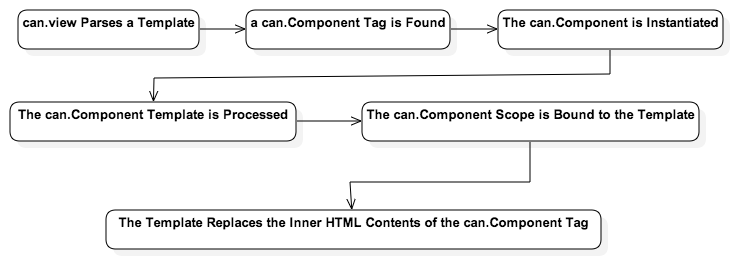
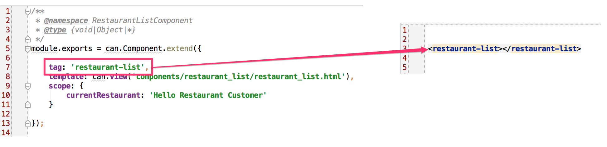
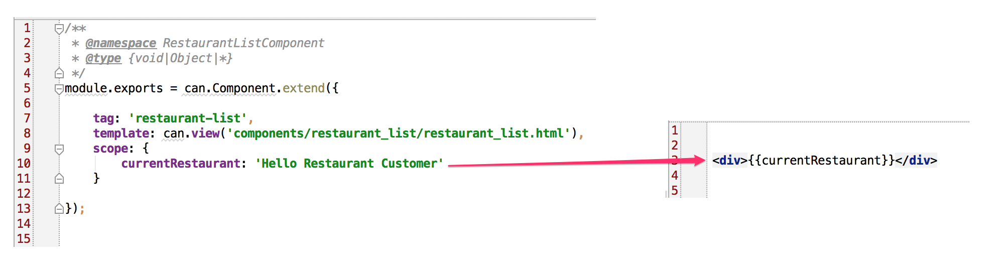

#First can.Component 

If you recall from the introduction, a can.Component is a little bit like a self-contained, mini web application. Because can.Components are encapsulated entities, ideally they each contain their own:

- View template
- JS
- CSS

This is why we created a components folder for our app---instead of, say, a JS folder. Each component we develop will be in a folder that also stores all the files that support that component. This makes components portable, enabling you to reuse them across projects. It also isolates them, making them easier to test and maintain.

In the components folder, create a subfolder called "restaurant_list". Inside that, create the following files: 

- RestaurantListComponent.js. 
- restaurant_list.html

For now, we won't have a CSS file for the RestaurantList can.Component.

Put the following code inside RestaurantListComponent.js:

	/**
     * @namespace RestaurantListComponent
     * @type {void|Object|*}
     */
    module.exports = can.Component.extend({
    
            tag: 'restaurant-list',
            template: can.view('components/restaurant_list/restaurant_list.html'),
            scope: {
            		currentRestaurant: 'Hello Restaurant Customer'
            }
    
        });

Now, edit restaurant_list.html, as follows:

	
{{currentRestaurant}}

Finally, edit the /app/base_template.html, as follows:

	<restaurant-list></restaurant-list>

Notice that all we have to do is declare the can.Component, using its extend method. In CanJS, extend methods create constructor functions. Normally, before you could actually work with an object you defined using an extend method, you'd have to instantiate it. We'll see examples of this when we work with can.Map. can.Components are the exception. Once you declare your can.Component, it's as if you've registered your component with the system. When CanJS parses the base_template.html file, and encounters the restaurant-list tag, it will automatically instantiate the can.Component associated with it, and do the work of generating the Component's view inside of its custom tag. 

Let's look at an image that describes how all of this works, to make it clearer:

##Basic Anatomy of a can.Component
The can.Component we created above had three properties. At a minimum, you need to define at least two of these properties for your can.Component to function:

- tag, and
- template

Usually, you'll define a "scope" property, as well. There are some interesting ways to work with scope, however, which we'll look at later.

###The "tag" Property
The can.Component's tag property associates that can.Component with a specific, custom HTML tag, as below:

As mentioned above, when the template containing the can.Component's tag is parsed, the can.Component is instantiated, and the contents of its rendered template are inserted as the HTML contents of the custom tag, as below:

###Template
The template property of the can.Component contains the string value of the can.Component's template. Note that the template property just contains a string value. You can inline the template, if it is small; however, the recommended way of working with templates, to maintain separation of concerns, is to keep them in their own files, and load them using can.view, as we have done here.

###Scope
The scope object contains the properties and methods the can.Component will use. Any property or method defined on the scope object is available from the can.Component's template as either a Stache data key, or a function. In our example above, we created a property, "currentRestaurant", and then referenced it as a Stache data key in our template. 

The scope is a special type of object, called a can.Map. can.Map objects are observable. Observable objects provide a way for you to listen for and keep track of changes to them. What this means, practically, is that if you make a change to your scope, those changes will be reflected automatically in your template. We'll see how this works in the next chapter.