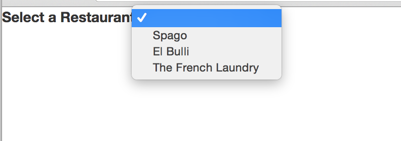
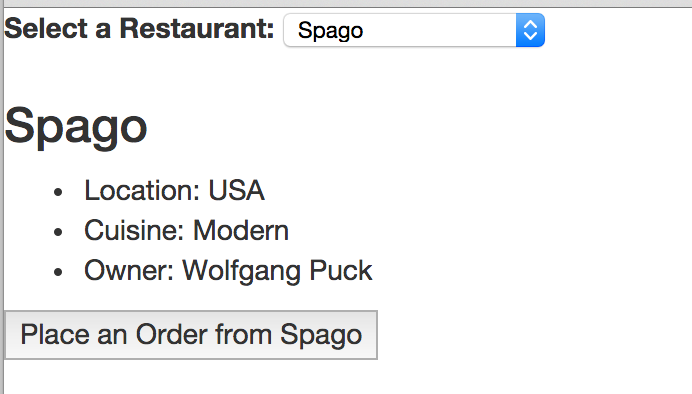

# Models (&amp; Fixtures) 
	
The next item we're going to go over is can.Model. Models are really cool. They make interacting with JSON REST services *really easy*. We'll use can.Model to provide data for our restaurant list. 

In the models folder, create a subfolder called "restaurants". In that folder, create two files:

- RestaurantModel.js
- RestaurantModelFixture.js

RestaurantModel.js should look like this:

	/**
     * @namespace RestaurantModel
     */
    module.exports = can.Model.extend({
            findAll: "GET /restaurants"
        });
 

can.Model.extend can take up to three parameters:

1. name
2. staticProperties
3. instanceProperties

Name is an optional parameter that specifies the globally-available name of the constructor function. We won't use that here.

The staticProperties parameter has several reserved properties you can add that simplify accessing data from a JSON REST service. These properties are:

1. findAll
2. findOne
3. create
4. update
5. destroy

The findXxx methods are available directly off of the object definition. The create, update, and destroy methods are available off of specific instances of a can.Model. We'll see how to use these below.

##The Data for Our Model

We're not going to connect to a server to retrieve our data; however, we're going code our model as if we were. How can this possibly work? CanJS provides a handy utility, can.fixture, that we can use to mimic the functionality of connecting to a server. As the CanJS docs say, "can.fixture intercepts an AJAX request and simulates the response with a file or a function. You can use them to develop JavaScript independently of backend services."

can.fixture is not included with the base CanJS package. Adding it in, however, is easy. In fact, we've already done it. Back in [Application Foundations](#app-foundations), when we created our index.html file, we put this line directly below where we included CanJS:

	

That's all you need to do to include can.fixture in your project. Now, let's create a fixture that will respond to our requests for menu item data. Open up the RestaurantModelFixture.js file we created. Add the following code to that file:

	/**
     * @namespace RestaurantsModelFixture
     */
    module.exports = (function () {
    
        function initFixture() {
            can.fixture("GET /restaurants", function requestHandler() {
    
                return [
                    {
                        "name": "Spago",
                        "location": "USA",
                        "cuisine": "Modern",
                        "owner": "Wolfgang Puck",
                        "id": 1
                    },
                    {
                        "name": "El Bulli",
                        "location": "Spain",
                        "cuisine": "Modern",
                        "owner": "Ferran Adria",
                        "id": 2
                    },
                    {
                        "name": "The French Laundry",
                        "location": "USA",
                        "cuisine": "French Traditional",
                        "owner": "Thomas Keller",
                        "id": 3
                    }
                ];
            })
        };
    
        return {
            initFixture: initFixture
        };
    
    }());
   
The first argument to can.fixture, "GET /restaurants", tells CanJS to intercept any GET requests to the resource "/restaurants". The second argument is a function that returns the data we want to simulate. Because we're simulating a findAll method, we need to return an array. The findAll method expects an array. If it does not receive one, it will throw an error.

##Connecting the Model to the Component

It's time now to connect all of this together in our view model. Open up RestaurantListComponentViewModel.js, and edit it as follows:

	/**
     * @namespace RestaurantListComponentViewModel
     * @type {void|Object|*}
     */

	var RestaurantModel = require('../../models/restaurant_list/RestaurantsModel');
	var RestaurantListFixture = require('../../models/restaurant_list/RestaurantsModelFixture');

	module.exports = (function () {

    	RestaurantListFixture.initFixture();

    	return can.Map.extend({

        	restaurants: new RestaurantModel.List({}),
        	currentRestaurant: undefined,
        	restaurantSelected: function (viewModel, select) {
            	var restaurant = select.find('option:checked').data('restaurant');
            	var currentRestaurant = 'currentRestaurant';
            	this.attr(currentRestaurant, restaurant);
        	}

    	});

	}());

Let's go over a few details in the code above to make sure they're clear. First, we make a call to initFixture. We need to register the fixture with CanJS before we make a call to the model. Next, there are a few ways to call a findAll method on a can.Model. The first way is to call the method explicitly. Using the RestaurantModel as an example, that would look like this:

	RestaurantModel.findAll({//paramsObject}, 
		function success(returnedObject){
			//
		},
		function error(errorObject){
			//
		});

In the code above, we called the findAll method indirectly. We did it in this line:

		restaurants: new RestaurantModel.List({}),

This is a special feature of the can.Model.List constructor. When can.Model is extended, can.Model.List is automatically extended, as well, and set as that model's List property. If a can.Model.List is instantiated and you pass in a plain JavaScript object for its construction parameter, that parameter is used as the parameter for the Model's findAll method. At first, this will return an empty list; however, the can.Model's findAll method will then be called, and the list will be populated with the results of that call automatically, once the findAll method receives its results.

We'll look at the can.Model's findOne method later on, when we create our Menu Component.

Let's go back to our app now, and see what happens! If everything went according to plan, you should see something like this:

And, when you select a restaurant from the list, you should see:

